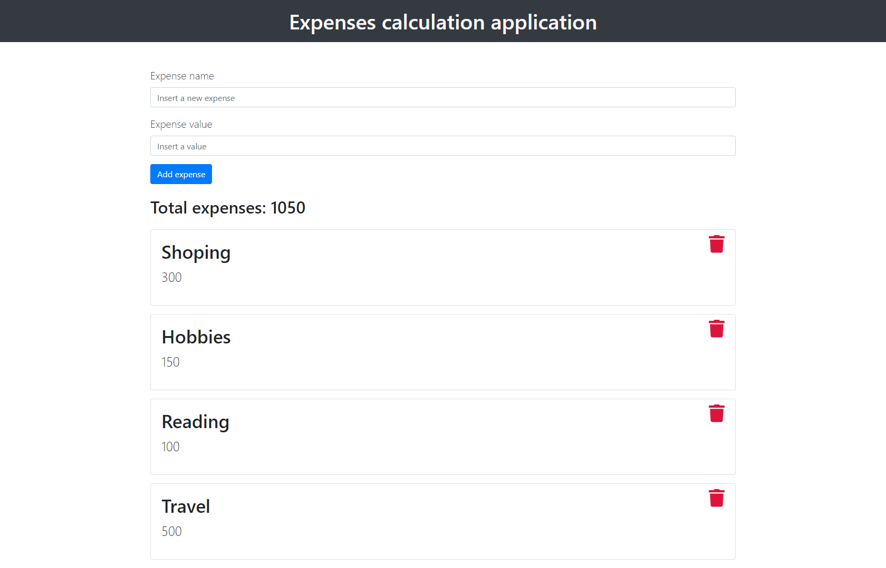

# Svelte.js - Expense calculation application

November 2020

> 🔨  Expenses calculation application made with Svelte.
>
> From Udemy: [Svelte de A à Z](https://www.udemy.com/course/svelte-de-a-a-z/)

* * *

<h1 align="center">
    
</h1>

## About

Simple application to calculate expenses. Expenses are displayed in cards and you can add or delete
them.



## How to test

- Clone
- `npm install`
- `npm run dev`

## How to make a Github page

- Pages must be served with Sapper
- Link the app to a Github repository
- `npm install -D gh-pages`
- Modify *package.json*

````json
"scripts": {
    "dev": "sapper dev",
    "build": "sapper build --legacy",
    "export": "sapper export --legacy",
    "start": "node __sapper__/build",
    "deploy": "sapper export --legacy &&  gh-pages -d __sapper__/export"
},
````
- `npm run deploy`
- set the gh-pages branch that was just deployed as the main branch for GitHub Pages to read from.

## Useful links

- [Svelte.js](https://svelte.dev/)
- [Sapper](https://sapper.svelte.dev/)
- [Getting started with Svelte](https://developer.mozilla.org/en-US/docs/Learn/Tools_and_testing/Client-side_JavaScript_frameworks/Svelte_getting_started)
- [Svelte training sources](https://github.com/Ziratsu/SourceSvelte)
- [Page npm UUID](https://www.npmjs.com/package/uuid)
- [Creating a blog with Svelte, Sapper and GitHub Pages](https://newcurrent.se/blog/create-markdown-sapper-svelte-blog)